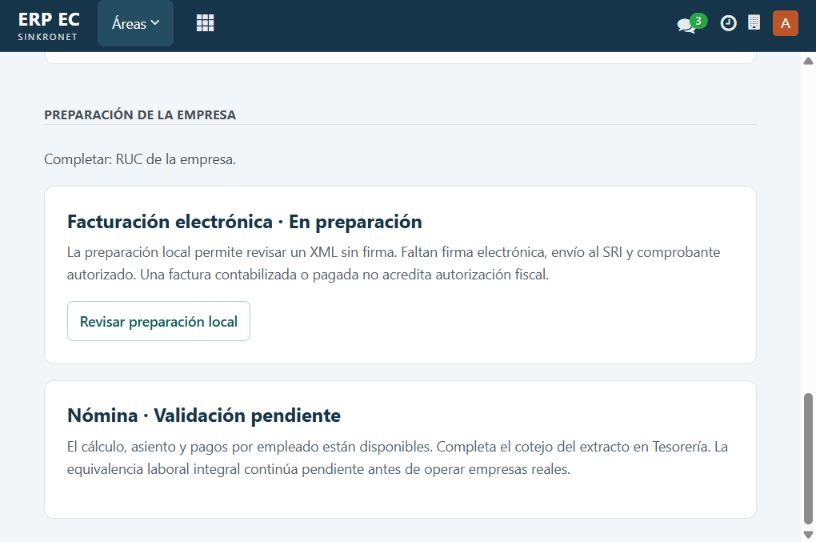
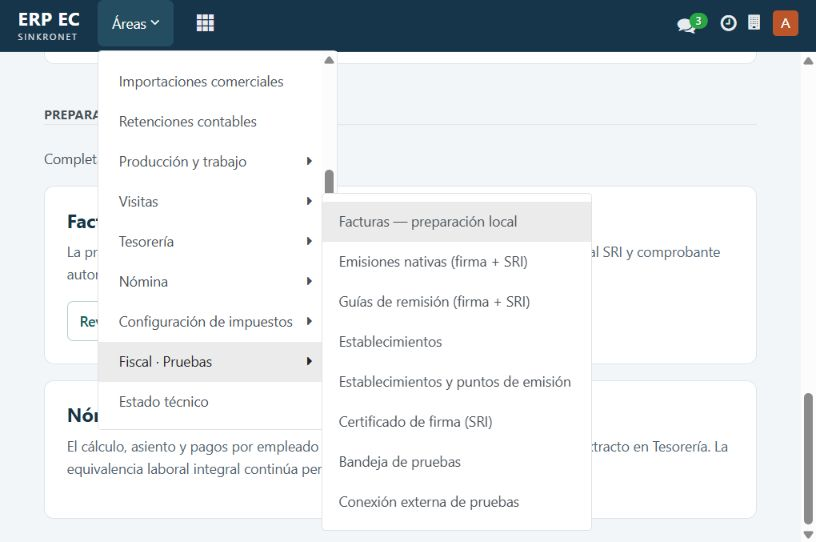
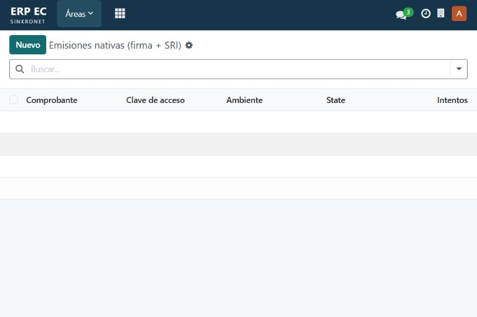
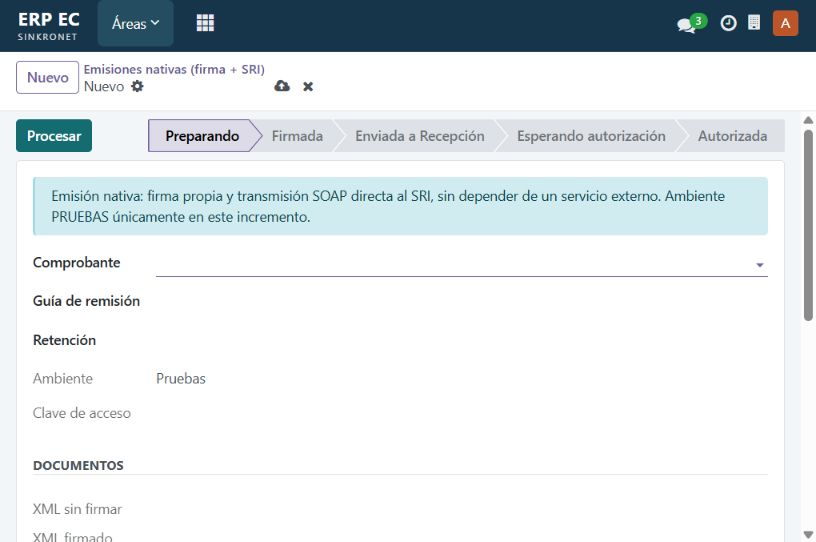

# Diagnóstico integral ERP EC — DI25

Corte local: 20-09-2026, America/Guayaquil (ejecución técnica también fechada 21-09-2026 UTC).
Base de código: f97affa8cf36ca0389597b973ae1b5dbeb6b38a9.
Alcance autorizado: diagnóstico y despliegue documental del Plan Haiky, contexto, AuditLock y prompts. No se ejecutan las correcciones funcionales de este plan.

## Dictamen

El ERP dispone de implementación local considerable, incluida emisión nativa, nómina, tesorería, fabricación, importaciones, planes y secretos cifrados. No es correcto volver a describirlo como un mero plan ni afirmar que no existe firma SRI. Tampoco existe evidencia suficiente para certificar cumplimiento integral Ecuador o salida comercial.

Se registran **20 hallazgos: 13 P1 y 7 P2**. P1: integridad fiscal/laboral, privacidad, seguridad o fiabilidad de validación que debe resolverse antes de liberar el alcance afectado. P2: usabilidad, mantenibilidad o aceptación pendiente. No se asigna P0 sin incidente crítico demostrado.

## Método y límites

- Lectura de RULES.md, contexto completo por tramos, plan maestro, módulos y ejecutores relevantes; inventario de addons.
- Gobierno comprobado antes de editar. Su éxito prueba un eslabón y entregables, no toda la historia ni funcionamiento (DI25-18).
- Navegación real de demo en 127.0.0.1:8369 con sesión ya abierta; cinco capturas nuevas guardadas e inspeccionadas. No se introdujeron credenciales ni se guardaron formularios.
- Reproducciones del motor puro de nómina y del método de selección fiscal con búsqueda simulada: evidencia DI25/repro-result.json. El segundo ensayo no ejecuta SQL ni transporte.
- Suite integrada en base nueva: resultado y límites en DI25/validacion.json. Primer intento bloqueado por permisos del filestore; no contar como fallo funcional.
- Fuentes oficiales consultadas en esta pasada; se separa requerimiento normativo de inferencia técnica. No hay dictamen jurídico individual ni trámites ante autoridades.
- No se enviaron comprobantes, correos, transferencias o declaraciones como parte del diagnóstico. No se modificaron repositorios fuente.
- UI/UX es un muestreo actual del acceso y flujo fiscal. Ventas, compras, producción, inventario, importaciones, nómina, visitas y tesorería requieren aceptación visual completa por rol en DI25-07. La suite automatizada no sustituye esa aceptación.
- No se practicaron pentest, carga productiva, accesibilidad con lector de pantalla ni inspección exhaustiva de cada línea del núcleo Odoo. Las ausencias de cobertura se registran como límites, no como defectos inventados.

## Resultado de validaciones de esta ejecución

Suite integrada Windows en base nueva: **432 pruebas reportadas, 0 fallos, 0 errores y 5 omisiones explícitas de Tesorería por ausencia de datos sembrados**; ejecutor terminó con código 0. Se analizaron 22 manifiestos, 190 archivos Python y 49 XML. El primer intento no produjo resultados por permisos del filestore; el segundo se ejecutó con acceso autorizado. Los errores SQL de pruebas negativas no son fallos de la suite según su resumen final.

Las cinco omisiones no acreditan las rutas de Tesorería dependientes de demo; quedan como aceptación pendiente DI25-07. Las reproducciones aisladas confirman diferencias y riesgos fuera de la cobertura del resumen verde.

## Hallazgos trazables

| ID | Prioridad | Naturaleza | Hallazgo | Fase |
|---|---|---|---|---|
| DI25-01 | P1 | Código + reproducción aislada | Cola fiscal puede dejar emisiones válidas sin procesar | DI25-02 |
| DI25-02 | P1 | Código; riesgo de integración | Autoridad fiscal exclusiva no se comprueba en ambos sentidos | DI25-02 |
| DI25-03 | P1 | Código; requiere ensayo ORM | Protección del documento nativo firmado incompleta | DI25-02 |
| DI25-04 | P1 | Motor ejecutado + código agregador | RDEP mezcla base anual acumulada con impuesto del último registro | DI25-03 |
| DI25-05 | P1 | Código | Corrección de nómina omite beneficios del período y conserva cuotas | DI25-03 |
| DI25-06 | P1 | Código + límite de alcance | Una bandera grava conjuntamente conceptos laborales diferentes | DI25-03 |
| DI25-07 | P1 | Código + portal oficial | ATS incompleto y procedencia de catálogo pendiente de conciliar | DI25-04 |
| DI25-08 | P1 | Código + norma oficial | Transmisión inmediata no queda acreditada por cola de un minuto | DI25-02 |
| DI25-09 | P1 | Código | Exclusión comercial no integrada a la entrega de campañas | DI25-05 |
| DI25-10 | P1 | Código | Clave del conector fiscal sigue como Char sin cifrado propio | DI25-05 |
| DI25-11 | P1 | Código; cierre de dependencias | Imagen controller omite dependencia de PayPhone | DI25-01 |
| DI25-12 | P1 | Código | Ejecutor Linux puede aceptar resumen verde pese a salida fallida | DI25-01 |
| DI25-13 | P1 | Código; riesgo condicionado | Nombre arbitrario del ensayo usado en limpieza privilegiada | DI25-01 |
| DI25-14 | P2 | Visual actual + código | Inicio fiscal comunica capacidades desactualizadas | DI25-06 |
| DI25-15 | P2 | Visual actual + código | Bandeja ofrece creación manual que el servidor prohíbe | DI25-06 |
| DI25-16 | P2 | Visual actual | Entrada pública de demo conserva plantilla y enlaces sin destino | DI25-06 |
| DI25-17 | P2 | Código + visual | Solapamiento de adaptadores, menús y sustentos | DI25-02 |
| DI25-18 | P2 | Código + revisión documental | Gobierno valida un eslabón y nueve prompts históricos | DI25-01 |
| DI25-19 | P2 | Código + obligación por evaluar | Privacidad requiere operación y aplicabilidad por empresa | DI25-05 |
| DI25-20 | P2 | Cobertura pendiente | Aceptación comercial transversal y externa sin cierre integral | DI25-07 |

### DI25-01 — Cola fiscal puede dejar emisiones válidas sin procesar

**P1 · Código + reproducción aislada**. Evidencia: `addons/erpec_fiscal_sri/models.py:635,673`.

_cron_process selecciona diez registros id desc excluyendo solo authorized/rejected. blocked y returned siguen entrando; action_process no los transmite ni consulta. Diez bloqueados recientes desplazan una firmada anterior. La reproducción ejecuta el método real con búsqueda simulada; falta caso ORM concurrente.

Corrección / aceptación: Seleccionar estados procesables, orden justo y bloqueo por trabajo; recuperación explícita y prueba de diez bloqueados más un pendiente.

### DI25-02 — Autoridad fiscal exclusiva no se comprueba en ambos sentidos

**P1 · Código; riesgo de integración**. Evidencia: `addons/erpec_fiscal_sri/models.py:913; addons/erpec_fiscal_connector/connector.py:251`.

Emisión nativa rechaza ec_fiscal_job_ids, pero action_queue_fiscal no consulta ec_fiscal_emission_ids. El nativo tampoco toma el mismo bloqueo de account_move que el conector. Existe ruta para asignar dos autoridades; no se enviaron documentos duplicados para demostrarla.

Corrección / aceptación: Guarda bidireccional y reserva atómica compartida; ensayar nativo→externo, externo→nativo y concurrencia sin red.

### DI25-03 — Protección del documento nativo firmado incompleta

**P1 · Código; requiere ensayo ORM**. Evidencia: `addons/erpec_fiscal_sri/models.py:770; addons/erpec_fiscal_connector/connector.py:302`.

Las guardas de cancelación, borrador y edición del conector miran trabajos externos; el módulo SRI protege los sustentos de reembolso pero no amplía esas guardas para todas las líneas/cabecera de la factura nativa. Odoo puede imponer restricciones adicionales; no se afirma alteración consumada de una factura autorizada.

Corrección / aceptación: Probar edición/cancelación/borrado mediante ORM con todos los módulos; fijar instantánea fiscal y política de corrección, sin confundir anulación contable con fiscal.

### DI25-04 — RDEP mezcla base anual acumulada con impuesto del último registro

**P1 · Motor ejecutado + código agregador**. Evidencia: `addons/erpec_payroll/annex_rdep.py:268; addons/erpec_payroll/engine.py:74`.

action_build ordena por id y conserva annual_tax_caused del último registro, mientras suma la base anual. Caso sintético con 11 meses de USD 1.000 y diciembre de USD 3.000: base acumulada 12.677; impuesto según tabla del repositorio 23,45 frente a proyección del último mes 2.296,70. No es una liquidación tributaria real. El orden id tampoco garantiza último mes.

Corrección / aceptación: Reconciliar impuesto anual con flujos reales, novedades y otros empleadores; tabla temporal, orden cronológico y aprobación contable independiente.

### DI25-05 — Corrección de nómina omite beneficios del período y conserva cuotas

**P1 · Código**. Evidencia: `addons/erpec_payroll/models.py:367,379,462,831`.

action_correct copia entradas escalares; no copia benefit_line_ids. action_reverse no neutraliza cuotas del libro y _compute_balance resta todas las deducciones sin filtrar estado del período. Recalcular una corrección puede perder beneficios o consumir otra cuota. No se declara pérdida monetaria real.

Corrección / aceptación: Reproducción con bono, préstamo parcial y reversión/corrección; conservar beneficios y vincular reversión/reaplicación de cuotas sin doble descuento.

### DI25-06 — Una bandera grava conjuntamente conceptos laborales diferentes

**P1 · Código + límite de alcance**. Evidencia: `addons/erpec_payroll/models.py:760; addons/erpec_payroll/engine.py:70`.

taxable controla IESS, renta, décimos, vacaciones y reserva juntos. La proyección mensual no incorpora acumulados previos ni retenciones anteriores. Es límite explícito del motor; no todos los beneficios o regímenes pueden representarse correctamente.

Corrección / aceptación: Matriz legal por concepto/base/régimen, equivalencia independiente y bloqueo visible de casos no soportados.

### DI25-07 — ATS incompleto y procedencia de catálogo pendiente de conciliar

**P1 · Código + portal oficial**. Evidencia: `addons/erpec_fiscal_native/ats_catalog.py:357; addons/erpec_workspace/tax_intersection.py; docs/PLAN_HAIKY_PRODUCCION_DESPLIEGUE.md`.

Hay catálogo y sustento por línea; no se encontró generador integral ATS en addons. La copia declara 03-03-2026, mientras el portal oficial lista catálogo 06-08-2026 y plugin 1.18.0 de 31-08-2026. La fecha distinta exige comparar archivos; no prueba por sí sola que los códigos locales sean incorrectos.

Corrección / aceptación: Comparar bytes/catálogos oficiales, versionar vigencia, completar compras/ventas/anulados aplicables y conciliar con contabilidad y DIMM.

### DI25-08 — Transmisión inmediata no queda acreditada por cola de un minuto

**P1 · Código + norma oficial**. Evidencia: `addons/erpec_fiscal_sri/models.py:950; addons/erpec_fiscal_sri/data/cron.xml`.

Emitir deja state=signed y espera procesamiento manual o cron de un minuto (lote de diez). El SRI comunica transmisión inmediata desde 01-01-2026. No se midió demora real bajo carga ni se concluye sanción automática por sesenta segundos.

Corrección / aceptación: Diseñar despacho inmediato durable, contingencia, latencia observable y conciliación; validar interpretación operativa con responsable tributario.

### DI25-09 — Exclusión comercial no integrada a la entrega de campañas

**P1 · Código**. Evidencia: `addons/erpec_data_protection/models.py:106; addons/erpec_data_protection/tests/test_data_protection.py:58`.

La bandera ec_marketing_email_opt_out solo se escribe/muestra/prueba; no hay consumidor de la preferencia en addons para mass_mailing o mail.blacklist. Marketing por correo está visible en demo. No se enviaron mensajes ni se comprobó un envío indebido.

Corrección / aceptación: Integrar exclusión con campañas y canal efectivo; probar destinatario excluido y separar correo comercial de rol de pago o comprobante transaccional.

### DI25-10 — Clave del conector fiscal sigue como Char sin cifrado propio

**P1 · Código**. Evidencia: `addons/erpec_fiscal_connector/connector.py:44,80`.

api_key tiene restricción de grupo y copy=False, pero se almacena como texto y se usa directamente. erpec_secrets cifra PayPhone y certificado; esa cobertura no alcanza al conector. No se leyeron valores privados.

Corrección / aceptación: Migrar al almacén compartido con rotación, respaldo y reversión; no mostrar ni registrar la clave.

### DI25-11 — Imagen controller omite dependencia de PayPhone

**P1 · Código; cierre de dependencias**. Evidencia: `deployment/linux/Dockerfile; addons/erpec_payphone/__manifest__.py`.

Dockerfile copia base/runtime/suite/provision/payphone, pero no erpec_secrets requerido por PayPhone. La suite Linux monta todos los addons en /extra y puede pasar ocultando el defecto de la imagen distribuida. Perfil customer solo empaqueta base/runtime: no equivale al ERP operativo local.

Corrección / aceptación: Validar dependencias y arranque de cada imagen sin montaje de fuentes; definir módulos contratados por perfil y verificar UI resultante.

### DI25-12 — Ejecutor Linux puede aceptar resumen verde pese a salida fallida

**P1 · Código**. Evidencia: `deployment/linux/run-tests.sh:25`.

La tubería docker|tee|grep termina con || true y la decisión final solo busca texto '0 failed, 0 error(s)'. Se pierde el código de salida de Docker y no se exige conteo positivo. No se ejecutó Docker en esta pasada.

Corrección / aceptación: Conservar PIPESTATUS de Docker, exigir pruebas positivas y manifest de módulos; prueba negativa con resumen verde seguido de exit no cero.

### DI25-13 — Nombre arbitrario del ensayo usado en limpieza privilegiada

**P1 · Código; riesgo condicionado**. Evidencia: `scripts/test-integrated.py:33,49`.

--name solo valida sintaxis. cleanup ejecuta DROP DATABASE IF EXISTS nombre WITH (FORCE) como postgres sin marcador de propiedad. Si existe una DB del mismo nombre y no su rol, CREATE ROLE puede pasar, CREATE DATABASE falla y finally elimina la DB preexistente. No se ensayó con datos reales.

Corrección / aceptación: Prefijo reservado, comprobación previa de DB/rol, indicador de creación efectiva y limpieza solo de recursos propios; prueba con dobles sin DROP real.

### DI25-14 — Inicio fiscal comunica capacidades desactualizadas

**P2 · Visual actual + código**. Evidencia: `docs/evidencias/DI25/02-alerta-fiscal.png; addons/erpec_workspace/views.xml:38`.

Inicio afirma que faltan firma y envío aunque el menú ofrece emisiones nativas. Es correcto advertir que la empresa demo no tiene RUC; es incorrecto atribuirlo a ausencia global del motor. Formularios también dicen solo pruebas pese a existir habilitación de producción.

Corrección / aceptación: Estado derivado de módulos, empresa, ambiente y certificado; separar falta de configuración, alcance técnico y validación externa.

### DI25-15 — Bandeja ofrece creación manual que el servidor prohíbe

**P2 · Visual actual + código**. Evidencia: `docs/evidencias/DI25/04-emisiones.png; docs/evidencias/DI25/05-formulario-sin-origen.png; addons/erpec_fiscal_sri/models.py:618`.

Nuevo abre formulario con Procesar, pero create exige token interno y origen contabilizado. Se abrió y descartó sin guardar. Lista vacía sin orientación y columna State en inglés.

Corrección / aceptación: Deshabilitar creación manual; mostrar enlace al comprobante/origen autorizado, estado vacío útil y etiqueta Estado.

### DI25-16 — Entrada pública de demo conserva plantilla y enlaces sin destino

**P2 · Visual actual**. Evidencia: `docs/evidencias/DI25/01-entrada.png`.

La raíz redirige a /es y muestra YourLogo, My Website, contacto de ejemplo y enlace Legal a #. La captura es demo local con sesión existente; no demuestra exposición pública productiva.

Corrección / aceptación: Entrada apropiada al producto; identidad, ayuda y destinos legales reales antes de publicación; probar visitante y usuario autenticado.

### DI25-17 — Solapamiento de adaptadores, menús y sustentos

**P2 · Código + visual**. Evidencia: `addons/erpec_fiscal_sri/models.py:792; addons/erpec_fiscal_native/models.py:36; addons/erpec_fiscal_documents/documents.py; docs/evidencias/DI25/03-menu-fiscal.png`.

_gather_native_common reconoce duplicación con vista previa. Existen reembolsos de compra y sustentos SRI de venta, y retenciones de referencia/contables/electrónicas. No son todos duplicados eliminables: hay propósitos distintos. Los accesos Fiscal y Facturación necesitan autoridad y etiquetas claras.

Corrección / aceptación: Mapa de dueño/consumidores, adaptador común para validación compartida y equivalencia; conservar entidades con semántica distinta y retirar rutas obsoletas con migración.

### DI25-18 — Gobierno valida un eslabón y nueve prompts históricos

**P2 · Código + revisión documental**. Evidencia: `scripts/verify-governance.cjs:15; .github/CODEX_CONTEXT.md`.

El verificador comprueba predecesor inmediato y hashes actuales, no recorre toda la cadena; solo exige prompts 00–08. Contexto mantiene cabecera 13-09 y estados superados en secciones antiguas. No hay evidencia de manipulación de archivos.

Corrección / aceptación: Validación recursiva hasta génesis con detección de ciclos, inventario de prompts actual y sección de estado vigente separada de historia.

### DI25-19 — Privacidad requiere operación y aplicabilidad por empresa

**P2 · Código + obligación por evaluar**. Evidencia: `addons/erpec_data_protection/models.py; addons/erpec_field_routes; docs/PLAN_HAIKY_CUMPLIMIENTO_LEGAL_EC.md`.

Existen RAT, solicitudes y brechas; no acreditan por sí solos avisos, conservación efectiva, contratos de encargado, transferencias, base de geolocalización o DPD cuando corresponda. El encabezado del módulo aún describe fuentes secundarias y ausencia de SMTP como si fueran estado actual.

Corrección / aceptación: Matriz por tratamiento, fundamento, responsable, plazo y evidencia; validar normativa SPDP y contratos; pruebas de acceso, exportación, conservación y exclusión.

### DI25-20 — Aceptación comercial transversal y externa sin cierre integral

**P2 · Cobertura pendiente**. Evidencia: `docs/OPERACION_LOCAL.md; .vscode/AuditLock.json; docs/VALIDACION_ARCHIVOS_BANCARIOS.md`.

La revisión visual actual cubre entrada/inicio/fiscal; no ciclos completos por comprador, bodega, operario, vendedor, nómina y contador. Siguen gates de producción SRI, SMTP, bancos, hosting, CI remoto y recuperación con clave separada. Evidencia histórica no se presenta como ensayo de hoy.

Corrección / aceptación: Matriz de escenarios por rol, pruebas negativas y concurrencia; actas externas por servicio, restauración sin tocar demo y decisión de salida por alcance.

## Recorrido visual actual

Las imágenes son las capturadas en esta auditoría. Se conserva el tamaño del navegador integrado; no representan una prueba de todos los tamaños de pantalla.

1. **Entrada raíz → /es: requiere corrección.** Plantilla visible y enlace Legal sin destino. DI25-16.
2. **ERP EC → inicio: requiere corrección.** Aviso útil de RUC faltante, pero explicación fiscal desactualizada. DI25-14.
3. **Áreas → Fiscal: navegable con ambigüedad.** Distingue algunas funciones, pero conviven preparación y emisiones; unificar orientación sin eliminar autoridades necesarias. DI25-17.
4. **Emisiones: accesible, estado vacío deficiente.** Se observa Nuevo y State, sin instrucción de origen. DI25-15.
5. **Nuevo: recorrido sin salida válida por diseño del servidor.** Se abre formulario y se descarta sin guardar; no se pulsó Procesar ni se transmitió. DI25-15.

Accesibilidad: hay botones con nombres en español y foco visible en el inicio. El icono de aplicaciones aparece como glifo en el árbol accesible; revisar nombre y comportamiento con lector real. Los menús anidados y desplazables exigen ensayo de teclado, Escape, foco y táctil. No se midieron ratios de contraste ni se declara conformidad WCAG.

## Duplicación: decisiones propuestas

| Función | Autoridad propuesta | Solapamiento / decisión |
|---|---|---|
| Asiento, cobro, stock y valoración | Modelos nativos Odoo | Accesos del centro son atajos, no motores nuevos; no eliminarlos por parecer duplicados. |
| Emisión y autorización | Una ruta por comprobante: nativa o conector | Guardas simétricas, bloqueo único y auditoría. Conservar conector para empresas que lo usen. |
| Construcción/validación de datos fiscales | Adaptador compartido con generadores por codDoc | Extraer lógica común entre preview y emisión solo con equivalencia y usos verificados. |
| Retención estimada, contable y electrónica | Etapas con vínculos explícitos | No borrar tablas como duplicadas sin analizar uso; separar estimación, asiento y autorización. |
| Reembolso de compras y de ventas SRI | Sustentos según dirección del negocio | Modelos parecidos no prueban duplicación funcional; compartir validadores compatibles. |
| Nómina y RDEP | Motor mensual + consolidación anual con reglas temporales | Reutilizar reglas, no proyecciones mensuales como resultado fiscal anual. |
| Cifrado | erpec_secrets | Integrar api_key del conector; conservar wrappers compatibles. |
| Preferencias comerciales | Fuente única sincronizada con el canal de campañas | El booleano aislado no es una supresión efectiva. |

## Cobertura legal Ecuador

Estado por dominio: “parcial” significa capacidad presente con brechas; “por validar” significa que este diagnóstico no acredita el requisito.

| Dominio | Capacidad / evidencia | Brecha y aceptación requerida |
|---|---|---|
| Comprobantes electrónicos | Generadores, XSD, firma, cola y RIDE en código; pruebas externas históricas registradas | DI25-01/02/03/08. Validación por tipo/ambiente; autorización no equivale a conciliación ni anulación. Ficha 2.34 ya citada localmente: no inventar desfase de versión. |
| Tributación y retenciones | Catálogos, casos y sustentos por línea, retención contable/electrónica | Tasas por vigencia, régimen, sujeto, operación; revisar IVA/IR/ICE/ISD y exclusiones aplicables, no imponer tarifa única a todo negocio. |
| ATS | Catálogo y clasificación parcial | DI25-07; alcance mensual/semestral y exenciones según contribuyente; validar archivo y aceptación sin inventar API. |
| RDEP / relación de dependencia | Vista previa XML y agregación | DI25-04; ejercicio aplicable, otros empleadores, ingresos variables, retenciones, exenciones y conciliación anual independiente. |
| Laboral e IESS | SBU 482, tasas generales 9,45/11,15; beneficios y anticipos | Coincidencia paramétrica no acredita jornadas, bases diferenciadas, liquidaciones, utilidades, avisos, pagos IESS o SUT. DI25-05/06. |
| LOPDP, geolocalización y nube | RAT, solicitudes, incidentes, cifrado parcial | DI25-09/10/19: bases jurídicas, minimización, contratos, conservación, ejercicio de derechos, DPD y transferencias según aplicabilidad. |
| Correo y documentos al cliente | Cola de roles y herramientas de campañas | Supresión comercial efectiva, trazabilidad de entrega, autenticación del dominio y separación transaccional; SMTP real pendiente. |
| Contabilidad y aduanas | Asientos, importaciones y costos | Conciliar compras/ventas/stock/impuestos; expediente de importación no acredita trámites SENAE, valoración aduanera ni obligaciones societarias. |
| Comercialización y licencias | Community fijado, módulos propios con licencia declarada | Confirmar titularidad/avisos y obligaciones de módulos transitivos, contratos SaaS y política pública real antes de publicación. |

Fuentes oficiales (consulta 20-09-2026 hora Ecuador; conservar fecha de versión y aplicabilidad al período):

- **EC-01** [SRI — Facturación electrónica](https://www.sri.gob.ec/facturacion-electronica): Portal consultado: ficha 2.34 (julio 2026), XML/XSD por comprobante. Debe revisarse la cobertura completa; validar XSD no equivale a autorización ni cumplimiento integral.
- **EC-02** [SRI — Transmisión inmediata desde 2026](https://www.sri.gob.ec/detalle-noticias?idnoticia=1240&marquesina=1): Comunicado oficial: transmisión inmediata desde 01-01-2026, resoluciones 14 de junio y 17 de julio de 2025. Vincula despacho, contingencias y latencia fiscal; no establece en esta revisión una tolerancia de cola.
- **EC-03** [SRI — Anexos y guías](https://www.sri.gob.ec/formularios-e-instructivos1): El portal lista catálogo ATS actualizado 06-08-2026 y programa ATS 1.18.0 de 31-08-2026. Comparar con la procedencia local 03-03-2026. Para RDEP confirmar ejercicio, ficha y esquema aplicables antes de entrega.
- **EC-04** [Ministerio del Trabajo — SBU 2026](https://www.trabajo.gob.ec/despues-de-casi-una-decada-hay-consenso-gobierno-empleadores-y-trabajadores-acuerdan-fijar-el-salario-basico-unificado-de-2026-en-usd-482-no-hay-imposicion-hay-union/): SBU 2026 USD 482; coincide con parameters_ec2026.py. No sustituye mínimos sectoriales ni reglas de jornada, región y régimen.
- **EC-05** [IESS — Preguntas frecuentes afiliación](https://www.iess.gob.ec/es/preguntas-frecuentes-afiliacion): Régimen privado bajo dependencia: 9,45 % personal y 11,15 % patronal; coincide con política local. Evitar extrapolar a todos los regímenes.
- **EC-06** [IESS — Obligaciones del empleador](https://iess.gob.ec/web/empleador/obligaciones): Aviso de entrada desde primer día, dentro de quince días siguientes; materia gravada incluye ingreso regular susceptible de apreciación pecuniaria. El ERP no acredita cumplimiento de avisos/pagos institucionales por calcular nómina.
- **EC-07** [SPDP — Resoluciones](https://spdp.gob.ec/resoluciones2/): Índice oficial para revisar normas sobre transferencias y protección de datos. Es inventario normativo, no evidencia de aplicabilidad individual ni lectura jurídica exhaustiva de cada resolución.
- **EC-08** [SPDP — Reglamento del delegado, resolución 2025-0028-R](https://spdp.gob.ec/wp-content/uploads/2025/07/028-R.pdf): Regula designación/registro del delegado. Determinar obligación por tratamiento y empresa; no asumir que todas las pymes están exentas o todas obligadas.
- **EC-09** [SPDP — Consultas 2026](https://spdp.gob.ec/consultas2026/): Criterios oficiales sobre deberes de responsables y encargados. Revisar LOPDP, reglamento y resoluciones aplicables para contratos, derechos y seguridad; una consulta no sustituye la norma.

Las fechas de portales son señales para revalidar versiones. No se sustituyó ningún catálogo ni se presentó una inferencia como reforma legal confirmada. En DI25-04/05 se exige texto primario completo, artículo/resolución, vigencia y decisión del responsable por cada regla que se implemente.

## Relación con diagnósticos anteriores

OP20–OP24 y sus evidencias permanecen como historia. Se reconocen arreglos previos (conector, pypdf, cifrado y rotación, pruebas Linux, RIDE y purga) sin atribuir sus resultados a esta ejecución. Los hallazgos nuevos de empaquetado, autoridad, agregación anual y UI pueden coexistir con una suite verde: miden escenarios distintos.

Continuar con [Plan Haiky DI25](PLAN_HAIKY_DIAGNOSTICO_MEJORA_DI25.md). Registro estructurado: [hallazgos](evidencias/DI25/hallazgos.json). No cerrar fases históricas 04–08 por publicar estos documentos.
