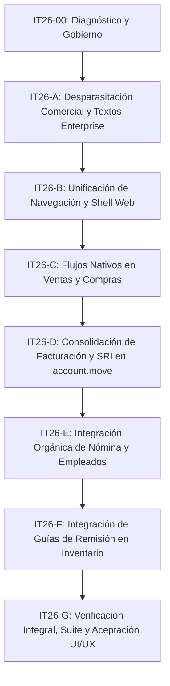

# Plan Haiky IT26 — Integración de la Tropicalización a Ecuador con Odoo Nativo y Comercialización

**Fecha:** 26 de septiembre de 2026 (Ecuador)
**Código del Plan:** IT26
**Documento fuente:** [Diagnóstico Técnico Integral IT26](DIAGNOSTICO_INTEGRACION_TROPICALIZACION_IT26.md)
**Objetivo general:** Transformar la localización a Ecuador en una experiencia nativa, fluida y comercialmente atractiva dentro de Odoo Community 18, eliminando la percepción de «apéndice sobrepuesto», erradicando referencias a Odoo Enterprise, unificando la navegación, y consolidando las pantallas críticas (Facturación, Ventas, Compras, Nómina, Guías) mediante hooks y patrones nativos de Odoo (`<xpath>`, smart buttons `oe_button_box`, botones en `<header>` y extensiones limpias).

---

## 1. Principios No Negociables del Plan (RULES.md y AGENTS.md)

1. **Cero regresiones técnicas:** Todo cambio en vistas y controladores debe preservar el funcionamiento de las reglas de negocio, modelos de datos, cálculos fiscales (XSD, SRI, ATS, RDEP) y de nómina. La suite de pruebas debe mantenerse en verde.
2. **Español de Ecuador técnico y comercial:** Eliminación de jerga interna de laboratorio (tickets, markdown, notas de desarrollo, avisos de migración pendiente) en favor de una UI/UX limpia y orientada al cliente final.
3. **Erradicación de referencias a Odoo Enterprise en UI:** El producto se comercializa como **ERP EC**; no se admite ninguna disculpa ni mención a "Enterprise" en la interfaz de usuario.
4. **Respeto a patrones nativos de Odoo:**
   - Botones de acción principales siempre en `<header>`.
   - Vínculos a documentos relacionados y estados siempre en `oe_button_box` (smart buttons) en la esquina superior derecha.
   - Ayuda pasiva en atributos `help="..."` o tooltips; conservar alertas visibles y accesibles cuando exigen una acción del usuario.
   - Evitar la creación de pantallas intermedias estáticas ("dashboards con botones") que dupliquen vistas estándar de Odoo.
5. **Cadena de gobierno verificable:** Cada fase debe validarse y sellarse mediante `scripts/seal-auditlock.cjs` y `node scripts/verify-governance.cjs`.

---

Preservar avisos de bloqueo, ambiente real de emisión, identificación de datos sintéticos y límites de validación externa; solo las notas de desarrollo y la ayuda pasiva se trasladan o retiran. Mantener permisos por rol y empresa, controles del servidor y avisos de licencias legalmente exigibles. La consolidación visual no autoriza eliminar modelos, tablas, historiales ni conectores activos; cualquier migración funcional necesita alcance y reversión propios.

## 2. Estructura de Fases y Dependencias

| Fase | Entrega | Depende | Hallazgos Atendidos | Estado |
|---|---|---|---|---|
| **IT26-00** | Diagnóstico, Plan Haiky, Contexto, Prompts y Despliegue de Gobierno | — | Diagnóstico general | Cerrada (26-09-2026) |
| **IT26-A** | Erradicación de referencias a Enterprise, avisos de laboratorio y alertas internas en XML | IT26-00 | IT26-06, IT26-07, IT26-08, IT26-10 | Cerrada (27-09-2026) |
| **IT26-B** | Unificación de la barra superior (NavBar), resolución de doble navegación y retiro de paneles estáticos | IT26-A | IT26-01 | Cerrada (27-09-2026) |
| **IT26-C** | Retiro de cajas de seguimiento intrusivas en `sale.order` y `purchase.order`; restitución de botones nativos | IT26-B | IT26-02 | Cerrada (27-09-2026) |
| **IT26-D** | Fusión de las 6 pestañas de `account.move` en un único flujo de facturación electrónica SRI | IT26-C | IT26-03, IT26-09 | Cerrada (27-09-2026) |
| **IT26-E** | Smart buttons en `hr.employee` (roles, liquidaciones, préstamos) y limpieza de vistas de nómina | IT26-D | IT26-05 | Cerrada (27-09-2026) |
| **IT26-F** | Integración de Guías de Remisión en Inventario (`stock.picking`) y reubicación de menús | IT26-E | IT26-04 | Cerrada (27-09-2026) |
| **IT26-G** | Suite integrada de pruebas (>660 tests), validación de accesibilidad y sellado de cierre | IT26-F | Cierre y aceptación | Cerrada (27-09-2026) |

---

## 3. Detalle de Fases y Criterios de Aceptación

### IT26-00: Diagnóstico y Despliegue de Gobierno
- **Objetivo:** Establecer la línea base técnica y desplegar los artefactos de gobierno.
- **Entregables:**
  - `docs/DIAGNOSTICO_INTEGRACION_TROPICALIZACION_IT26.md` publicado.
  - `docs/PLAN_HAIKY_INTEGRACION_TROPICALIZACION_IT26.md` publicado.
  - Prompts `.github/prompts/ERPEC26-IT26-*.md` creados.
  - `.github/CODEX_CONTEXT.md` y `.vscode/AuditLock.json` actualizados y sellados.
- **Criterio de salida:** `node scripts/verify-governance.cjs` ejecutado con éxito.

### IT26-A: Desparasitación Comercial y Erradicación de Textos Enterprise
- **Tareas:**
  1. Retirar la mención explícita a Enterprise en `addons/erpec_operations/views.xml` (Línea 19).
  2. Eliminar referencias a tickets y desarrollos internos (ej. "Caso 8 (DI25-03)...", "Ver docs/...") en `addons/erpec_payroll/views.xml`.
  3. Reemplazar advertencias apologéticas de laboratorio ("la migración desde SKNOMINA sigue pendiente", "Datos de demostración...") por descripciones estándar de Odoo.
  4. Retirar el texto hardcodeado "(ambiente PRUEBAS)" en `addons/erpec_fiscal_withholding_sri/views.xml`.
  5. Convertir textos de ayuda informativos en atributos `help="..."` de los campos respectivos.
- **Criterio de salida:** Ninguna vista XML contiene las palabras "Enterprise", "SKNOMINA", "DI25" o rutas "docs/".

### IT26-B: Unificación de Navegación y Shell Web Orgánico
- **Tareas:**
  1. Resolver la doble barra de navegación en `erpec_workspace/static/src/product_shell.xml`: unificar la marca `ERP EC` y el menú `Áreas` para que interactúen de manera armónica con el menú de aplicaciones de Odoo (`AppsMenu`).
  2. Garantizar que todas las aplicaciones de negocio (incluyendo Contactos, Empleados, Ajustes) sean accesibles fluidamente sin exclusiones arbitrarias.
  3. Retirar las pantallas estáticas intermedias (`Operación Ecuador` en `erpec_operations` y `Contabilidad ERP EC` en `erpec_withholding_accounting`), trasladando sus accesos y reportes como menús nativos dentro de las aplicaciones oficiales de Odoo (Ventas, Compras, Facturación, Inventario).
- **Criterio de salida:** Un usuario navega por todas las aplicaciones desde un único lanzador coherente, sin menús repetidos ni pantallas con botones redundantes.

### IT26-C: Flujos Nativos en Ventas y Compras
- **Tareas:**
  1. Retirar el bloque `
<h2>Seguimiento de la venta</h2>...
` en `addons/erpec_workspace/sale_views.xml`.
  2. Retirar el bloque `
<h2>Seguimiento de la compra</h2>...
` en `addons/erpec_workspace/purchase_views.xml`.
  3. Conservar `action_confirm` nativo en ventas y restablecer la variante oculta de `action_create_invoice` en compras, verificando permisos, estados y ausencia de acciones duplicadas.
  4. Canalizar contadores de entregas, recepciones y facturas hacia `oe_button_box` utilizando la estructura estándar de smart buttons de Odoo.
- **Criterio de salida:** Los formularios de pedidos de venta y compra lucen 100% estándar de Odoo, con toda la trazabilidad operando a través del header y smart buttons.

### IT26-D: Consolidación de Facturación y SRI en `account.move`
- **Tareas:**
  1. Unificar las 6 pestañas dispersas de `account.move` en una única pestaña organizada: `Comprobante Electrónico (SRI)`.
  2. Ubicar el botón primario de emisión `[Firmar y transmitir SRI]` en el `<header>` de la factura, visible únicamente cuando el comprobante está en estado `posted`.
  3. Añadir smart button en la cabecera con el estado oficial del comprobante ante el SRI (`[SRI: Autorizado / Rechazado / Pendiente]`).
  4. En facturas de compra con retención, vincular el comprobante de retención mediante un smart button nativo `[Retención SRI]`, permitiendo acceder e imprimir el comprobante con un solo clic.
  5. Ocultar vistas heredadas de pruebas o conectores externos obsoletos para que no ensucien la interfaz comercial.
- **Criterio de salida:** La factura de cliente y proveedor presenta un único flujo limpio de emisión electrónica y retención, sin pestañas duplicadas.

### IT26-E: Integración Orgánica de Nómina y Empleados
- **Tareas:**
  1. Añadir smart buttons en `hr.employee`:
     - `[Roles de Pago]` -> abre las líneas de nómina del empleado.
     - `[Décimos y Beneficios]` -> abre las liquidaciones acumuladas.
     - `[Anticipos / Préstamos]` -> abre las cuotas del colaborador.
  2. Limpiar la pestaña `Anexo RDEP` en `hr.employee` y `res.company`, transformando las alertas legales en campos ordenados con tooltips.
  3. Mejorar la vista de períodos de nómina (`erpec.payroll.period`), reemplazando banners de alerta por estados de flujo y diseño profesional.
- **Criterio de salida:** El departamento de recursos humanos gestiona la nómina y los beneficios del empleado directamente desde su ficha oficial.

### IT26-F: Integración de Guías de Remisión en Inventario
- **Tareas:**
  1. Mover la acción de Guías de Remisión al menú nativo de `Inventario -> Operaciones -> Guías de remisión`.
  2. En `stock.picking`, asegurar que el botón de generación de guía en el header y el smart button de enlace a la guía emitida sigan el patrón estándar de Odoo.
  3. Retirar el acceso a guías del menú secundario de pruebas fiscales.
- **Criterio de salida:** Los despachos de bodega emiten y consultan sus guías de remisión directamente desde la interfaz de inventario.

### IT26-G: Verificación Integral, Suite y Aceptación UI/UX
- **Tareas:**
  1. Ejecución de la suite completa de pruebas unitarias y de integración (>660 pruebas) sin fallos ni regresiones.
  2. Verificación de accesibilidad (axe-core, contraste, navegación por teclado).
  3. Ejecución de recorrido automatizado de menús (`ui-menu-crawl.py`).
  4. Sellado final del AuditLock y actualización de evidencia.
- **Criterio de salida:** Suite 100% en verde, gobierno íntegro y aceptación de UI/UX completada.

---

## 4. Control de Reversión y Gestión de Riesgos

- **Respaldo de versiones:** Todo cambio en vistas se aplica mediante `<xpath>` o reemplazo controlado en módulos propios.
- **Sin impacto en esquemas de base de datos:** El plan IT26 está centrado en la **capa de presentación (UI/UX), vistas XML, menús y experiencia de usuario**; no altera modelos de persistencia crítica ni destruye tablas contables o fiscales.
- **Reversibilidad inmediata:** Cada fase cuenta con commits atómicos específicos (`phase: IT26-X task: IT26-X.Y`) reversibles de forma aislada.
