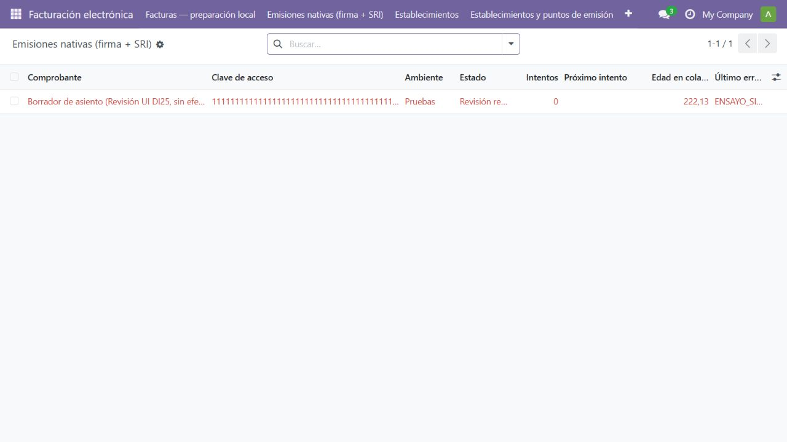
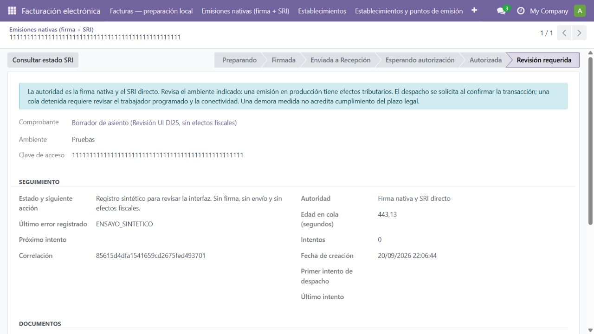
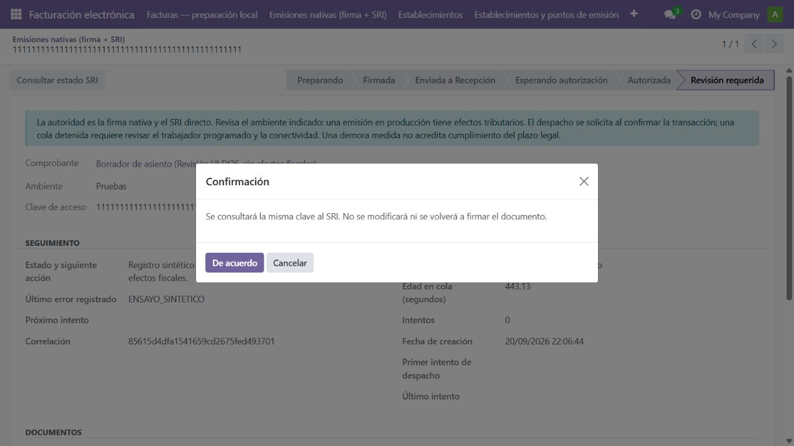
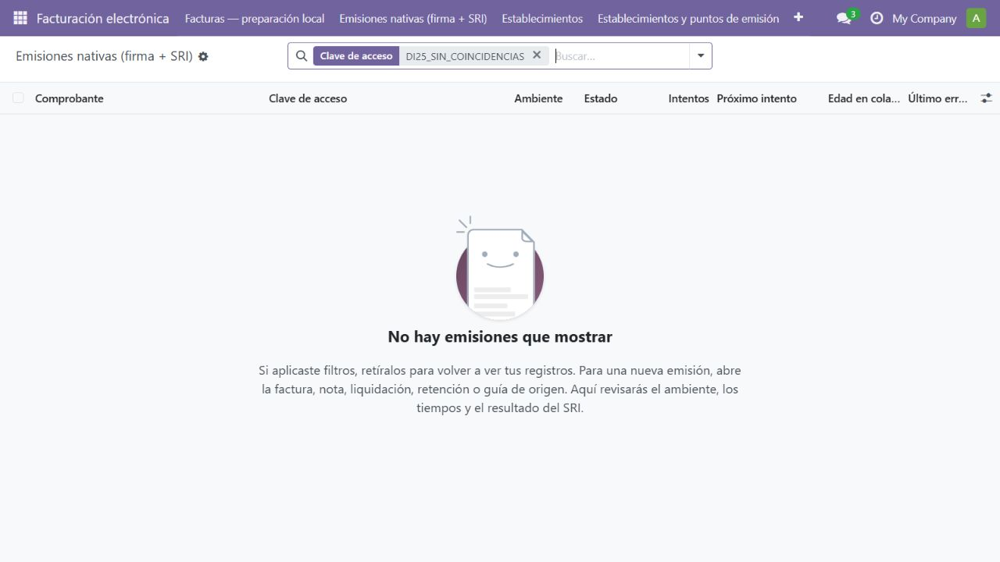

# DI25-02 — Revisión visual del seguimiento fiscal

Fecha: 21-09-2026 UTC. Instancia desechable ec_integrated_test_ui_789dbcf27d; navegador integrado, 1280 × 720, idioma es_EC. Registro sintético, sin certificado ni envío, cron desactivado. Objetivo: localizar una incidencia, identificar autoridad/ambiente y comprender la recuperación.

1. **Bandeja — operativa.** Presenta ambiente, estado, intentos, próxima fecha, edad y error. No ofrece crear una emisión sin origen. Los valores extensos se truncan en la tabla; el detalle conserva el contenido completo.

   

2. **Ficha — operativa.** El origen es un enlace de solo lectura. El seguimiento aparece antes de documentos y autorización: la incidencia y la siguiente acción son visibles al abrir. La demora no se presenta como cero confirmado cuando aún no existe primer intento.

   

3. **Recuperación — confirmación y cancelación verificadas.** La confirmación explica que consultará la misma clave sin modificar ni firmar el documento. Escape cierra el diálogo y devuelve el foco al botón. No se confirmó la consulta ni se llamó al SRI.

   

4. **Búsqueda vacía — operativa.** La búsqueda por clave funciona. La ayuda distingue la posibilidad de filtros y orienta a preparar una emisión desde su origen.

   

## Correcciones realizadas durante la revisión

Se eliminó la apariencia editable del origen, se tradujo la fecha de creación, se precisó que el primer despacho es un intento y se priorizó el seguimiento. La ayuda vacía indica retirar filtros antes de asumir que falta un documento.

## Accesibilidad y límites

Se observan etiquetas en español, estado expresado con texto y confirmación con botones identificables. Se comprobó cancelación por teclado y retorno del foco. Las capturas no acreditan contraste medido, lector de pantalla, navegación completa por teclado, adaptación móvil ni todos los roles; corresponden a DI25-06/07.

La cuenta sintética inicialmente no tenía el grupo contable y el acceso fue rechazado. Tras asignar el grupo en la instancia desechable e invalidar su caché, el recorrido fue accesible. No se cambiaron permisos de usuarios operativos.

La edad mostrada corresponde a la última lectura, no a un contador continuo. El registro mostrado es una incidencia sintética y no demuestra firma válida, autorización, transmisión inmediata ni aceptación comercial.
