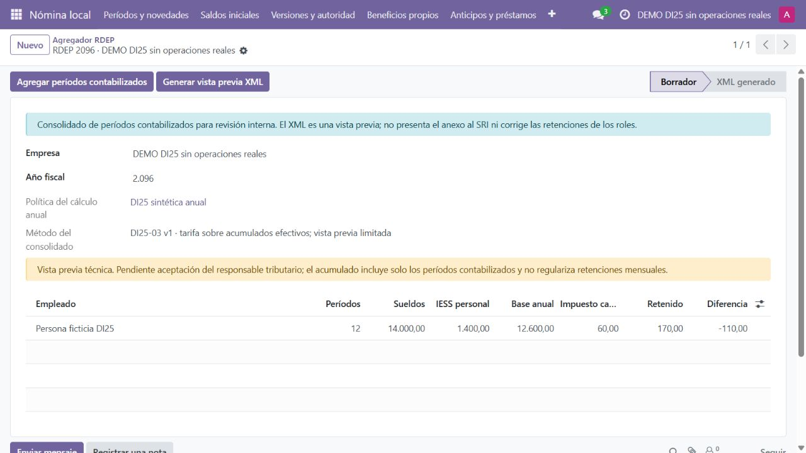
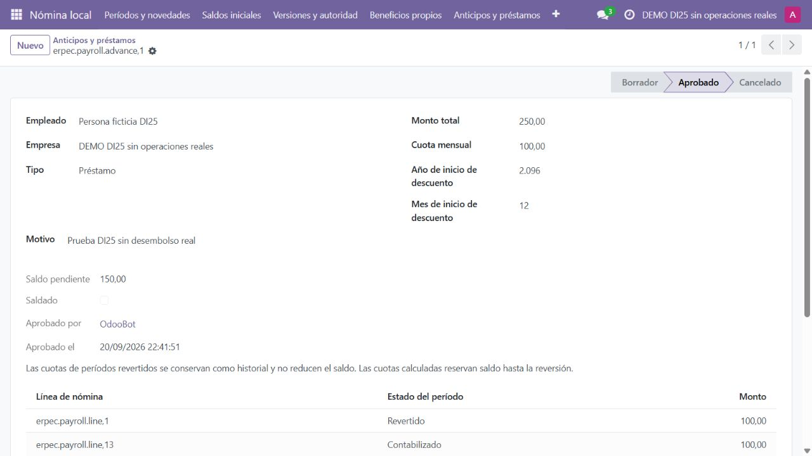
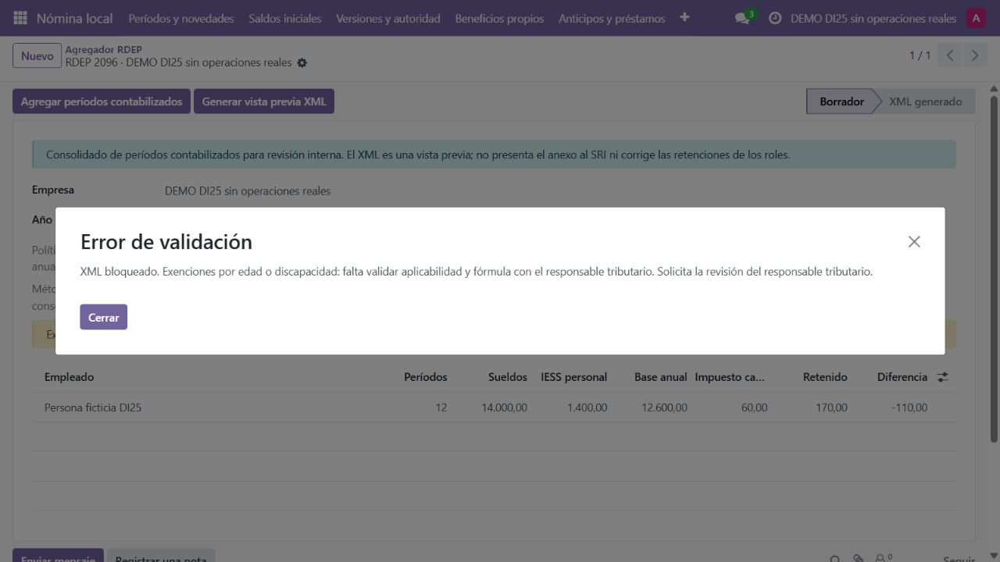

# DI25-03 — Verificación visual de nómina

Fecha: 21-09-2026 UTC. Instancia propia ec_integrated_test_ui_789dbcf27d, en 127.0.0.1:52038; 1280 × 720, usuario ficticio con permiso de responsable de nómina. Aplicada la skill product-design:audit. Datos, empleados, RUC de ensayo y asientos son sintéticos. Sin cron, SMTP, pagos ni presentación SRI. La demo del usuario no se modifica.

## Recorrido observado

1. Abrir Nómina local → Agregador RDEP → consolidado 2096. Se muestran doce períodos, política artificial, sueldos 14000, IESS 1400, base 12600, impuesto 60, retenciones 170 y diferencia −110. El desglose del empleado abre y permite consultar ingresos, aportes y conciliación. La diferencia no crea un ajuste contable.
2. Abrir Anticipos y préstamos → préstamo ficticio de 250. Se muestran saldo 150, cuota de 100 del período revertido y cuota de 100 de la corrección contabilizada. El historial explica por qué la cuota revertida no reduce saldo.
3. Preparar en la misma instancia un indicador sintético de discapacidad y reagrupar. La ficha muestra revisión pendiente. Pulsar Generar vista previa XML devuelve un bloqueo específico y exige revisión tributaria; no se genera XML. Escape cierra el diálogo y devuelve a la ficha.

Las tres capturas fueron guardadas e inspeccionadas desde disco. Sus hashes están en DI25-03-capturas.json. La carga inicial de recursos mostró una pantalla transitoria sin datos; se comprobó después la carga completa.

## Correcciones visuales y límites

Se sustituyó el título técnico del consolidado por año/empresa; etiquetas Empresa y Empleado en español. La tabla principal prioriza base, impuesto y diferencia; los beneficios detallados quedan disponibles como columnas opcionales y ficha. El aviso principal explica el alcance sin nombres de funciones internas.

Quedan aspectos para DI25-06: algunos nombres heredados de préstamos/líneas siguen técnicos, los campos del préstamo aprobado parecen editables aunque el servidor protege su inmutabilidad y un encabezado se abrevia según ancho. Escape cierra el error, pero el foco observado vuelve al área web; no se certifica retorno exacto al botón. No se ejecutaron aquí móvil, zoom 200 %, contraste, lector de pantalla ni todos los roles. Esta evidencia no acredita accesibilidad integral ni aceptación legal.

Respaldo anterior a instalar nómina: SHA256 ccd50bf0ccad678b15aaffd18048c7b1bb6fd6f6ea738b1bf2d3dd925bf970b6. Respaldo posterior con nómina sintética, antes de actualizar vistas: b6d54bc8ac31d3e2c99aea64a2e36a0fd3791ed486d9dbb11ab7e98e1114007b. Base y filestore conservados en almacenamiento local excluido de Git; instalación y actualización finalizaron con salida 0. No se atribuye a estos respaldos una restauración integral comprobada.
