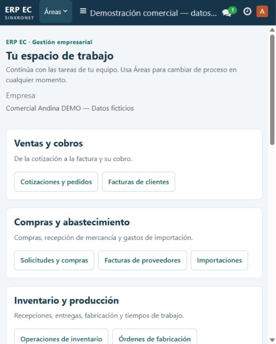
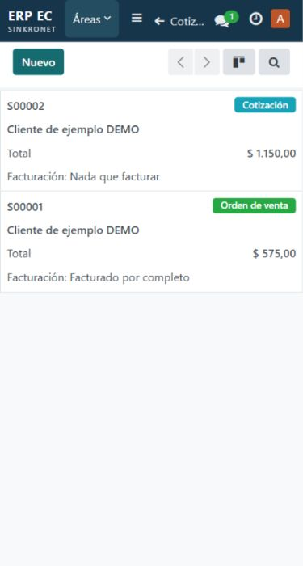
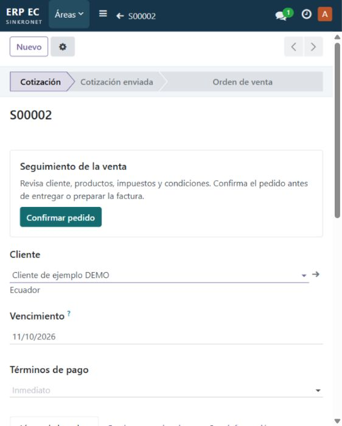
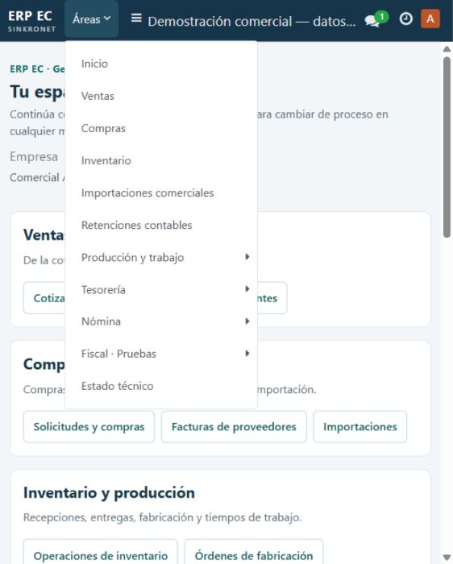

# Resultado de implementación UI/UX — ERP EC

13-09-2026. Alcance: inicio, ventas, cotización y Áreas. Cambios instalados en la demo local. La lógica comercial y los permisos se conservan.

## Recorrido verificado

1. **Inicio — aprobado.** Sin herramientas de ficha; empresa y advertencias conservadas. Capturas a 375, 562 y 1280 px.
2. **Ventas — aprobado.** Tarjetas nativas en móvil; cliente, importe y estado completos a 375 px, sin desbordamiento de página. Listado conservado en escritorio. Búsqueda S00002 y retirada de filtro comprobadas.
3. **Cotización — aprobado.** Confirmar pedido visible junto a la guía. Reutiliza action_confirm y validate_analytic. La prueba aislada confirma borrador/enviada y verifica ocultación en confirmado/cancelado; no se confirmó una cotización real en la demo.
4. **Áreas — aprobado.** Categorías con submenús nativos; flechas y Enter abren períodos de nómina, Escape devuelve el foco. Etiquetas accesibles para acciones, búsqueda y selector móvil.

## Pruebas y correcciones

- 21/21 pruebas del centro, compras, ventas y Tesorería, incluidas dos nuevas de UI/UX. Luego 9/9 pruebas del módulo para instalarlo de forma aislada; repetidas tras ajustes visuales.
- Diez áreas con vistas compiladas. Vínculos comerciales y totales de la venta por 575 y la compra por 230 preservados.
- Corregidos durante la revisión: selector y prioridad de estilos del inicio, flecha duplicada del submenú y herencia de nombres accesibles en formularios/listados.
- Hashes del módulo instalado coinciden con los archivos probados. Sin errores en la consulta final de consola del navegador.
- Respaldo final: workspace-install-20260913-152951. Hash de base y ruta completa en ERPEC26-UIUX-02.json. No se ejecutó una restauración.

## Evidencia y límites

ERPEC26-UIUX-00 a 03 registran cada fase; ERPEC26-UIUX-regresion.json conserva la suite comercial. ERPEC26-UIUX-02.json incluye resultados de ejecución, instalación y hashes de las capturas. Las capturas de ventas y confirmación se tomaron antes del último ajuste, que afecta únicamente a la barra del inicio; las del inicio y Áreas muestran las correcciones finales.

No certifica WCAG ni aceptación visual integral por todos los perfiles. No modifica ni valida emisión SRI, equivalencia laboral, banca o RDEP concurrente. Persiste como límite de alcance el comportamiento nativo de otros listados móviles y rutas históricas; no se rediseñaron todos los módulos del ERP.
